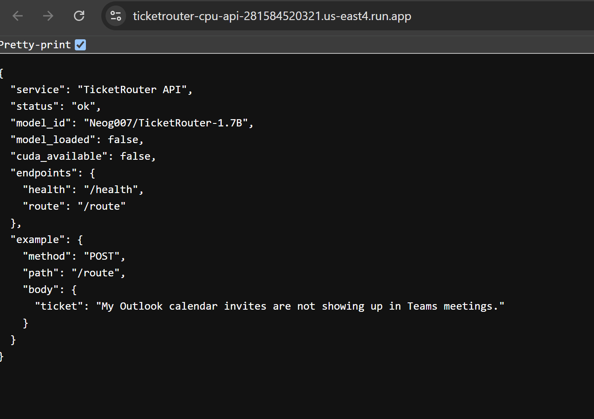
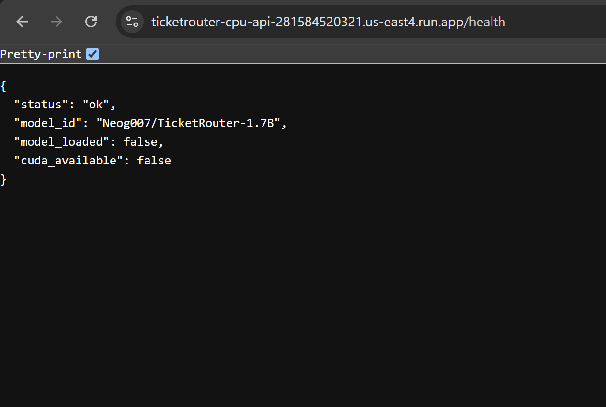
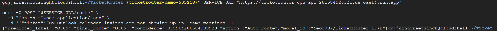
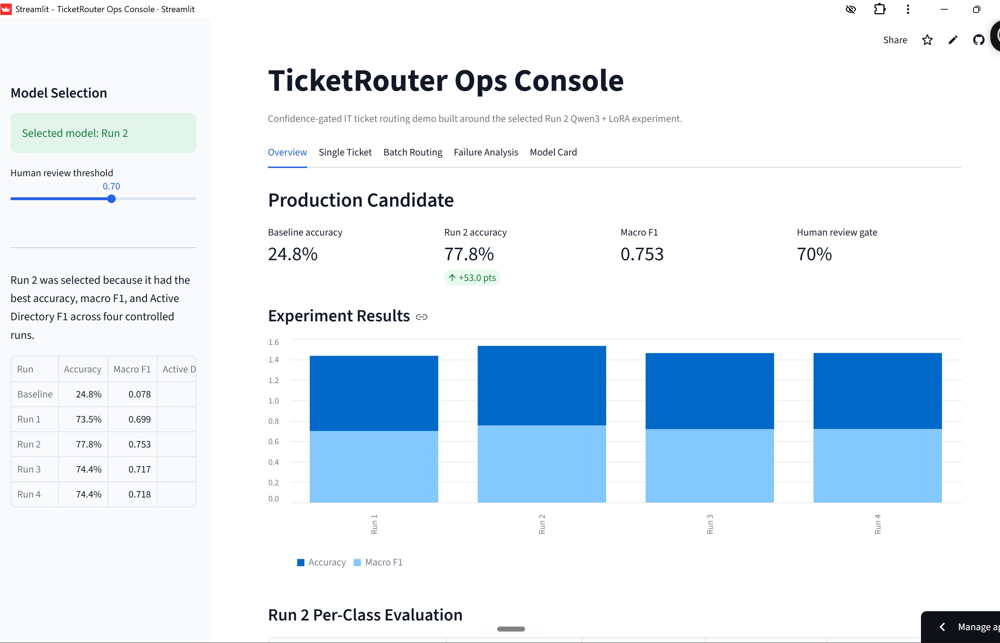
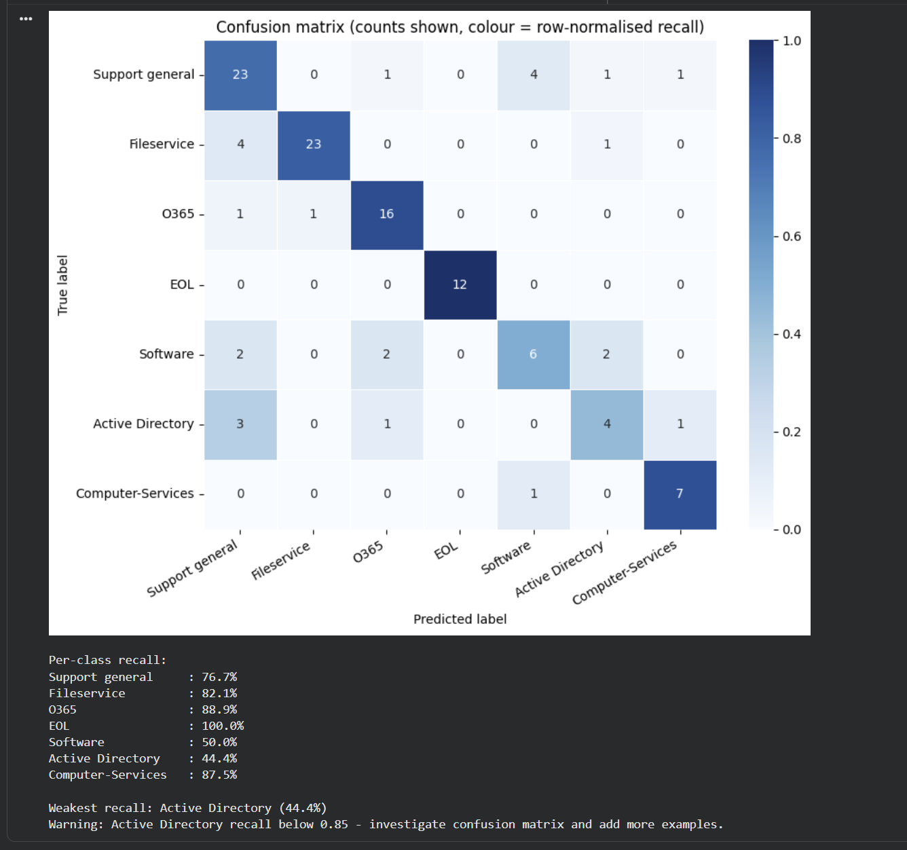

# TicketRouter

TicketRouter is an IT support ticket routing system built from a fine-tuned **Qwen3-1.7B + LoRA** model and deployed as a containerized **FastAPI service on Google Cloud Run**.

The selected model is **Run 2**, which improved validation accuracy from **24.8% baseline** to **77.8% fine-tuned accuracy** with a **0.753 macro F1**.

## Demo

**Live API:** `https://ticketrouter-cpu-api-281584520321.us-east4.run.app`


```text
Video -
(https://drive.google.com/file/d/1wqx1sejQiI2abX4ezylm68kC9ullkTMY/view?usp=sharing)
```

Suggested recording flow: open `/`, open `/health`, run a `POST /route` request, then show the Run 2 result summary.

## Deployed API Proof

The Cloud Run service exposes a small production-style API:

- `GET /` - service information and endpoint guide
- `GET /health` - model/service health check
- `POST /route` - model-backed ticket routing

### Service Landing Endpoint



### Health Endpoint



### Route Prediction



Example request:

```bash
SERVICE_URL="https://ticketrouter-cpu-api-281584520321.us-east4.run.app"

curl -X POST "$SERVICE_URL/route" \
  -H "Content-Type: application/json" \
  -d '{"ticket":"My Outlook calendar invites are not showing up in Teams meetings."}'
```

Example response:

```json
{
  "predicted_label": "O365",
  "final_route": "O365",
  "confidence": 0.9964,
  "action": "Auto-route",
  "model_id": "Neog007/TicketRouter-1.7B"
}
```

## Ops Console

I also built a Streamlit ops console to present the model like an internal helpdesk routing tool. It includes single-ticket routing, batch routing, confidence gating, failure analysis, and a model card.



## Experiment Results

| Metric | Run 1 | Run 2 | Run 3 | Run 4 |
|---|---:|---:|---:|---:|
| Accuracy | 73.5% | **77.8%** | 74.4% | 74.4% |
| Active Directory F1 | 0.308 | **0.471** | 0.308 | 0.267 |
| Software F1 | 0.600 | 0.522 | **0.609** | 0.583 |
| Macro F1 | 0.699 | **0.753** | 0.717 | 0.718 |

**Final decision:** Run 2 is the production candidate because it had the best accuracy, best macro F1, and best Active Directory F1 across four controlled experiments.

Run 3 added targeted boundary examples. Run 4 kept those examples and increased epochs to 4. Both stayed at 74.4% accuracy, which showed that the regression was caused by data quality and label ambiguity, not simply under-training.

## Failure Analysis

The confusion matrix shows strong routing for O365, EOL, Fileservice, and Computer-Services. The weakest class is **Active Directory**, mostly because ambiguous access tickets can look similar to Fileservice or O365 requests.



Key observations:

- **EOL** was the strongest class, with 100% recall in Run 2.
- **O365** performed well because tickets often contain clear Outlook, Teams, mailbox, or Office signals.
- **Active Directory** remained the riskiest class because account, group, folder, and access-language overlap across multiple queues.
- The production mitigation is a **confidence-based human review gate** for ambiguous tickets.

## Architecture

```text
Notebook experiments
        |
        v
Qwen3-1.7B + LoRA adapter
        |
        v
Merged Hugging Face model artifact
        |
        v
FastAPI inference service
        |
        v
Docker image in Artifact Registry
        |
        v
Google Cloud Run endpoint
```

## Production Decisions

| Decision | Choice |
|---|---|
| Base model | `Qwen/Qwen3-1.7B-Base` |
| Fine-tuning | LoRA via LLaMA Factory |
| Selected run | Run 2 |
| Model host | Hugging Face: `Neog007/TicketRouter-1.7B` |
| Serving layer | FastAPI |
| Deployment | Docker + Google Cloud Run |
| Safety layer | Low-confidence predictions route to human review |
| Current public demo | CPU-only Cloud Run service |

GPU deployment was prepared for NVIDIA L4 on Cloud Run, but the available GCP project quota limited GPU execution. The public demo runs CPU-only, which is slower on first request but still proves the deployment path end to end.

## Run Locally

### Streamlit Ops Console

```bash
pip install -r requirements.txt
streamlit run app.py
```

### Cloud Run API Locally

```bash
cd cloudrun
pip install -r requirements.txt
uvicorn app:app --host 0.0.0.0 --port 8080
```

Then test:

```bash
curl http://localhost:8080/health

curl -X POST http://localhost:8080/route \
  -H "Content-Type: application/json" \
  -d '{"ticket":"My Outlook calendar invites are not showing up in Teams meetings."}'
```

## Deploy To Cloud Run

```bash
PROJECT_ID=$(gcloud config get-value project)
REGION="us-east4"
REPO="ticketrouter"
SERVICE="ticketrouter-cpu-api"
IMAGE="$REGION-docker.pkg.dev/$PROJECT_ID/$REPO/ticketrouter-cpu-api:v1"

gcloud builds submit ./cloudrun --tag "$IMAGE"

gcloud run deploy $SERVICE \
  --image "$IMAGE" \
  --region $REGION \
  --cpu 4 \
  --memory 16Gi \
  --timeout 900 \
  --concurrency 1 \
  --min-instances 0 \
  --max-instances 1 \
  --allow-unauthenticated \
  --set-env-vars MODEL_ID=Neog007/TicketRouter-1.7B,REVIEW_THRESHOLD=0.70
```

Scale down after demo:

```bash
gcloud run services update ticketrouter-cpu-api \
  --region us-east4 \
  --min-instances 0 \
  --max-instances 0
```

## LinkedIn Assets

Deployment-focused carousel and post copy are ready here:

- `docs/linkedin/TicketRouter_Deployment_Carousel.pdf` - 5-page PDF carousel focused on Cloud Run deployment
- `docs/linkedin/TicketRouter_Deployment_LinkedIn_Post.txt` - LinkedIn caption/post copy

## Project Files

- `TicketRouter_Run2_Targeted_Accuracy.ipynb` - selected production candidate
- `TicketRouter_Run3_Failure_Driven.ipynb` - boundary-data experiment
- `TicketRouter_Run4_Failure_Driven_4Epochs.ipynb` - controlled epoch-count experiment
- `app.py` - Streamlit ops-console app
- `streamlit_app.py` - lightweight local ops-console variant
- `cloudrun/` - FastAPI model-serving backend
- `docs/assets/` - README screenshots
- `docs/demo/` - slot for the short demo video

## Final Takeaway

TicketRouter is not just a fine-tuning notebook. It includes controlled experiments, failure analysis, a confidence-gated routing policy, and a deployed Cloud Run inference endpoint that demonstrates the model as a real engineering system.
